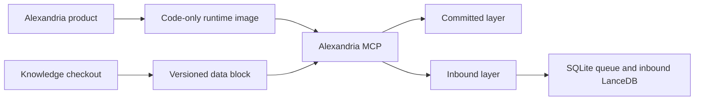
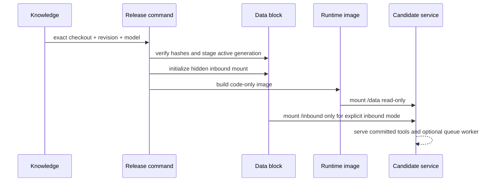

# Alexandria

Alexandria is the stateless runtime for serving a versioned knowledge data block
through MCP. The private corpus remains in the separate Knowledge repository;
this repository owns code, tests, packaging, deployment manifests, and operating
instructions.

## Boundary



The image contains runtime code and pinned dependencies only. A release data
block contains the exact committed source snapshot, LanceDB generation, model
files, and a receipt tying those bytes to a Knowledge revision. The committed
portion is mounted read-only. The optional `.alexandria-inbound` directory is
the only writable path and stores uncommitted submissions, receipts, and their
derived index.

## Repositories

| Repository | Owns | Does not own |
|---|---|---|
| `Knowledge` | Markdown/text corpus, architecture, provenance, research, graph run evidence | Runtime code, image build, deployment package |
| `Alexandria` | MCP runtime, graph implementation, tests, data-block tooling, image and deployment manifests | Private corpus, generated index, model cache, credentials |

The product checkout currently has no remote configured. Add one only after an
exact registered URL is explicitly selected.

## Data-block preparation

Prepare a block from an exact Knowledge checkout and an already verified active
index:

```text
python runtime/prepare_data_block.py \
  --knowledge /path/to/Knowledge \
  --active-data /path/to/Knowledge/.alexandria-data \
  --revision <exact-commit> \
  --model BAAI/bge-small-en-v1.5 \
  --output /path/to/alexandria-data-2026.09.20
```

The command refuses a revision or model mismatch and verifies every indexed
Markdown/text source hash before writing the block. It creates:

```text
/data/active.json
/data/builds/<generation>/source/...
/data/models/...
/data/release-data-receipt.json
/data/.alexandria-inbound/{catalog.sqlite3,content,queue,receipts,index}
```

Build the code-only image from `runtime/`. Mount `/data` read-only and mount
`/data/.alexandria-inbound` as `/inbound` only when inbound mode is explicitly
enabled:

```text
docker build -t alexandria:<calver> runtime
docker run --rm -p 8000:8000 \
  --read-only \
  --mount type=bind,src=/path/to/alexandria-data,dst=/data,ro \
  --mount type=bind,src=/path/to/alexandria-data/.alexandria-inbound,dst=/inbound \
  alexandria:<calver> serve --data /data --inbound /inbound \
    --transport streamable-http --host 0.0.0.0 --port 8000
```

The default server exposes five read-only tools: `search`, `text_search`,
`read_document`, `status`, and `list_files`. `submit_inbound` is registered
only with `--enable-inbound`; it writes server-generated IDs into the inbound
mount, records the verified MCP principal, and returns a queued receipt. The
worker indexes one submission at a time and never mutates the committed
generation.

## Release order



The existing Saturn deployment is the rollback target until a replacement has
passed parity, authentication, inbound durability, and restart checks. No
remote image registry or automatic deployment is part of this first split.
