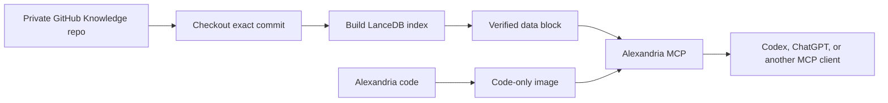

# Alexandria

Alexandria serves a versioned Markdown/text knowledge base through MCP. The
Knowledge repository is the source of truth; this repository contains the
runtime, index preparation, tests, image definitions, deployment contracts, and
operating tools.

## From a GitHub knowledge repository to a working MCP



1. Check out the Knowledge repository at the exact commit you want to serve.
2. Build the LanceDB index over the records marked `release_status: eligible`
   in `Alexandria/corpus/corpus-manifest.json`. Held and excluded records are
   never silently indexed.
3. Prepare a data block containing the source snapshot, index, embeddings,
   model files, and release receipt.
4. Build the code-only Alexandria image and run it with the data block mounted
   at `/data` read-only.
5. Connect a local client through stdio, or expose Streamable HTTP behind HTTPS
   and OAuth for remote clients.

The running service does not query GitHub. It searches the attached data block,
so GitHub credentials never enter the image or the serving process.

The detailed commands are in [Getting started](docs/getting-started.md). The
complete release and replacement procedure is in [Release workflow](docs/release-workflow.md).

## Quick local run

After creating a verified data block at `/path/to/alexandria-data`:

```bash
docker build -t alexandria:2026.09.20 -f docker/Dockerfile .
docker run --rm -i \
  --network none \
  --read-only \
  --mount type=bind,src=/path/to/alexandria-data,dst=/data,readonly \
  alexandria:2026.09.20 serve --data /data
```

The default read-only MCP surface is:

| Tool | Purpose |
|---|---|
| `search` | Semantic retrieval |
| `text_search` | Literal ripgrep search |
| `read_document` | Read a bounded document range |
| `status` | Report the served generation and block state |
| `list_files` | List the authorized document tree and hashes |

`submit_inbound` is an explicit optional feature. It requires a writable
`/inbound` mount and `--enable-inbound`; the committed layer remains read-only.
Held graph packages are separate inspection artifacts. They are unavailable
unless the server is started with `--graph-inspection` and a graph candidate or
store is supplied.

## Updating a deployment

There is no automatic GitHub-to-production refresh yet. Each update is a
reviewable release: pull the new Knowledge commit, rebuild and verify the data
block, build an image when runtime code changed, smoke-test the pair, and replace
the service while retaining the previous pair for rollback.

## Where to read next

- [Documentation index](docs/README.md)
- [Repository layout and boundaries](docs/repository-layout.md)
- [Runtime contract](docs/runtime/README.md)
- [Deployment contracts](deployment/README.md)
- [Graph workflow](docs/graph/README.md)

Internal versions use CalVer `YYYY.MM.DD`. The current verified Python baseline
is 3.12, and the product uses the `pi.alexandria` PEP 420 namespace.
