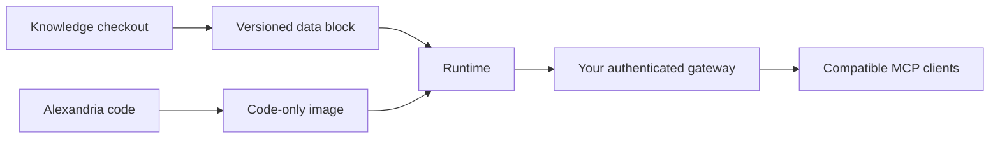

# Deployment templates

Alexandria is deployed as a code-only image plus a versioned data block. The
committed data mount is read-only; an explicitly enabled inbound mount is the
only writable application path. These files are public templates, not a live
cluster receipt. Fill every `REPLACE_WITH_*` value from your own inventory
before applying anything.

| File | Purpose |
|---|---|
| `data-block.md` | Data-block contract and rollback boundary. |
| `kubernetes-attached-block.template.yaml` | Generic attached-block Deployment and Service template. |
| `kubernetes-remote.example.yaml` | Hardened remote MCP example with identity and gateway placeholders. |
| `kubernetes-local-smoke.example.yaml` | Offline local smoke-test example. |

Do not commit live hostnames, private addresses, tunnel identifiers, OAuth
subjects, key material, or release receipts to this public repository. Keep
those records in the private operations/Knowledge repository.
