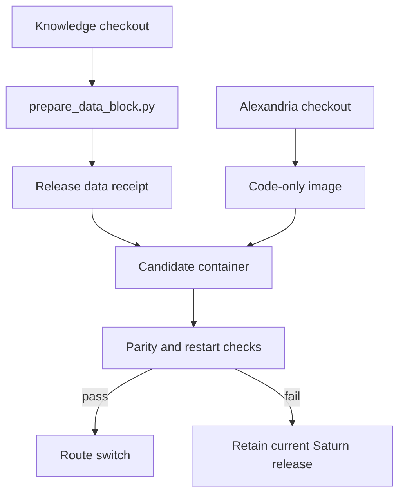

# Deployment

Alexandria is currently packaged as a code-only image plus one versioned data
block. The existing Saturn release is retained as rollback material while the
product split is tested.

Read [data-block.md](data-block.md) for the mount and replacement contract.
The copied Kubernetes files are historical references from the first manual
deployment and are not applied automatically. A live candidate manifest must
be generated only after the exact cluster, namespace, volume, image-loading,
gateway, and identity identifiers have been verified.

Use [kubernetes-attached-block.template.yaml](kubernetes-attached-block.template.yaml)
as the starting shape for that candidate. It has placeholders on purpose; do
not apply it until they have been replaced from the live inventory and the
image digest, data-block receipt, identity registration, and gateway route have
been reviewed together.

