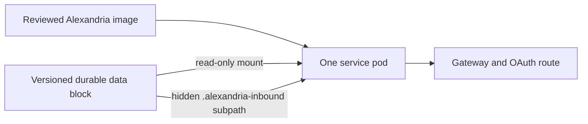

# Data-block deployment contract

This is a deployment contract, not an apply-ready manifest. The exact cluster
volume name, namespace allocation, image-loading mechanism, and public route
must be selected from the live infrastructure inventory before a manifest is
applied.

Mount the same durable block through two logical paths:

| Path | Mode | Purpose |
|---|---|---|
| `/data` | read-only | `active.json`, selected LanceDB generation, source snapshot, model files, release receipt |
| `/inbound` | read-write only when explicitly enabled | `.alexandria-inbound/catalog.sqlite3`, content, queue, receipts, inbound index |

The image contains only the runtime. The service starts with `--data /data`.
Adding `--inbound /inbound` makes the mount available to the process; adding
`--enable-inbound` is a separate, explicit decision that registers
`submit_inbound` and starts the worker.

The committed mount must remain read-only. The inbound mount must be a
subpath of the same durable block so replacing the container preserves queued,
indexed, and failed submissions. The service must run as a non-root user, with
a read-only root filesystem and only a bounded temporary filesystem in
addition to these mounts.

Before applying a candidate deployment, record:

1. the exact product revision and data-block receipt;
2. the selected cluster guest and namespace identifiers;
3. the selected durable volume and backup receipt;
4. the private image transfer/load receipt;
5. the gateway resource URL, issuer, JWKS URL, scope, and owner subject; and
6. the previous image-plus-block pair retained for rollback.

The current deployment remains the rollback target until a candidate
passes parity, authentication, restart, inbound durability, and route checks.
