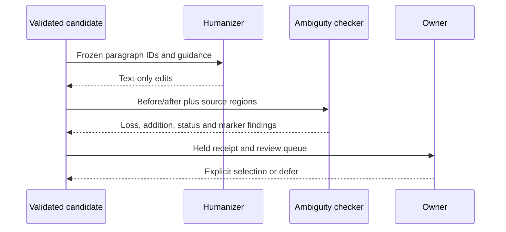

# Editorial and ambiguity contract

The editorial stage is a constrained text edit over a validated candidate. It
does not decide disputed meaning.

| Stage | May change | Must preserve |
|---|---|---|
| Humanizer | Sentence flow and unnecessary filler | Facts, qualifiers, dates, negation, status, citations, IDs, markers |
| Ambiguity check | Add or retain an explicit marker and review note | The source wording and unresolved alternatives |
| Meaning check | Reject a candidate with loss or unsupported additions | Every source region and every claim relationship |

The public Humanizer source is pinned in the packaged `assets/fixtures/`
directory for offline contract tests. It is guidance, not an authority over
the Knowledge corpus.
