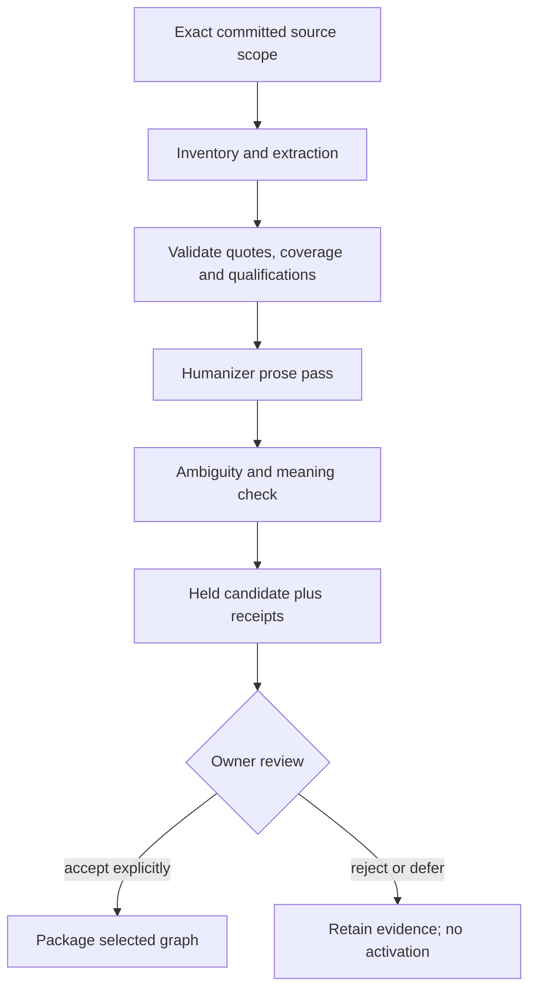

# Preservation workflow

The preservation pipeline creates a reviewable candidate. It never promotes a
candidate into accepted graph knowledge by itself.

Every claim carries a source quote and a local qualification. Ambiguous or
scope-sensitive text retains an explicit marker such as
`[AMBIGUOUS: a1]`; the pipeline does not guess which interpretation is right.
Humanizer edits may improve prose but may not change claims, paragraph
identity, evidence, status, or ambiguity markers.

The product tests use synthetic documents and the pinned public Humanizer
fixture in `src/pi/alexandria/graph/assets/fixtures/`. Live documents and
provider results stay in Knowledge.
