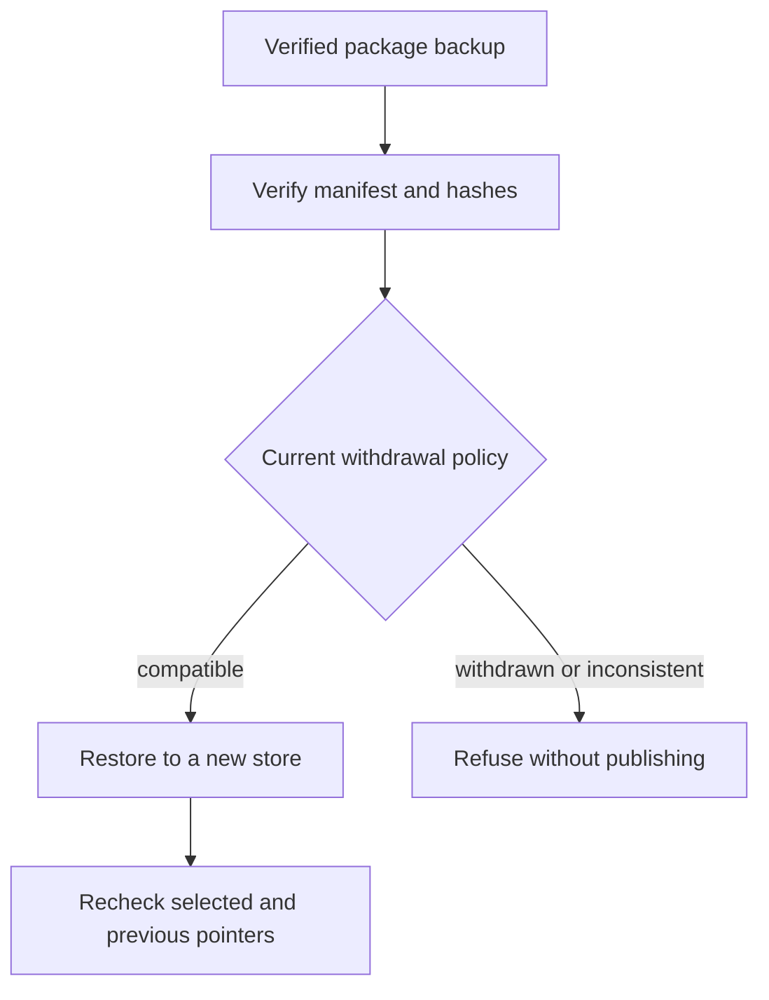

# Graph package recovery

Recovery is a local, explicit operation over a selected graph store. It does
not search for a “best” package or ignore a withdrawn source.

Use the implementation and tests in `recovery.py`, `generation.py`, and
`tests/test_recovery.py`. Restore into a fresh destination; the current store
is never overwritten by a failed attempt.
