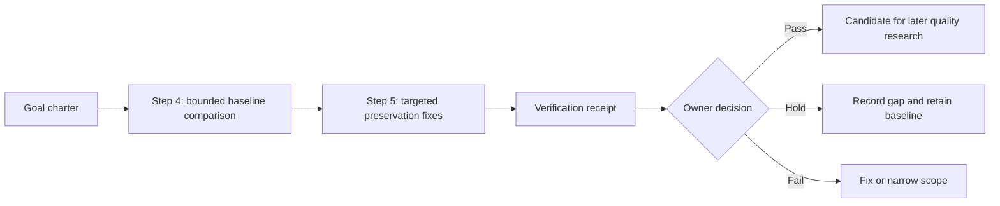

# Goal: preserve status and ambiguity through graph generation

**Goal message:** Turn the known semantic defects in Alexandria's held graph
trial into a small, repeatable quality gate. The gate must preserve source
status, scope, conditions, and uncertainty without silently promoting a claim or
choosing an interpretation.

This goal is the working package for quality steps 4 and 5. Each task is completed
only when its verification evidence is recorded. A passing phase produces a
receipt; it does not authorize deployment or publication.

## Definition of done

- A frozen contrast set covers accepted, proposed, open, requirement, limitation,
  historical, deferred, and genuinely ambiguous statements.
- Expected statuses and evidence are written before the pipeline runs.
- The current pipeline's known failures are reproduced or explicitly explained.
- Evidence mappings survive the Humanizer stage, or a remapping is held for review.
- The source-first coverage ledger distinguishes reviewed, unresolved, and not-checked regions.
- The targeted fix passes the same cases and one unfamiliar local document without
  changing the active index or serving deployment.
- Every unresolved result remains visible as `held`; no candidate is silently
  promoted to accepted knowledge.

## Non-goals

This goal does not select a new embedding or reasoning model, add hybrid ranking,
process the full corpus, refresh the production index, publish a graph, or change
the MCP deployment. Those are separate decisions after this gate is trustworthy.

## Phase map

## How to work this package

1. Read this goal and the current phase file before changing anything.
2. Work only the next `planned` task in `tasks.jsonl` whose dependencies are complete.
3. Keep source snapshots, expectations, outputs, and receipts in a fresh run directory.
4. Update the task status and append evidence to `verification.md` after the task.
5. Stop at a hold or failed gate. Do not make the next phase green by rewriting
   expectations or deleting an earlier attempt.
6. Record decisions that change scope or interpretation in `decisions.md`.

## File map

| File | Purpose |
|---|---|
| `goal.md` | Goal message, boundaries, definition of done, and phase map |
| `tasks.jsonl` | One-line work queue that can be advanced task by task |
| `phase-04-bounded-comparison.md` | Step 4 execution contract |
| `phase-05-targeted-fix.md` | Step 5 implementation and rerun contract |
| `verification.md` | Evidence, gates, receipt fields, and final decision |
| `decisions.md` | Scope and interpretation decisions made during the goal |

## Recorded result (2026.09.21)

Step 4 completed with a held baseline receipt. The frozen comparison reproduced
the two targeted defects: genuine ambiguity lacked a claim-level hold, and a
review-state rule was promoted into accepted claims.

Step 5 completed with a passing targeted fix. The deterministic quality gate now
holds unresolved ambiguity, reports status-inflation findings, and prevents
automatic acceptance. The rerun passed all nine frozen cases, preserved
Humanizer paragraph mappings, and passed the unfamiliar-document check.

The candidate remains explicitly held pending owner review. No production index,
deployment, or model strategy changed. The authoritative receipts are:

- `Knowledge/Alexandria/graph/goals/2026.09.21-status-ambiguity/step-04-baseline/comparison.json`
- `Knowledge/Alexandria/graph/goals/2026.09.21-status-ambiguity/step-05-targeted-fix/comparison.json`
