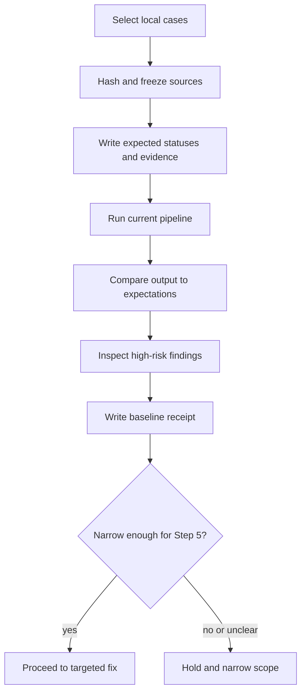

# Step 4: bounded baseline comparison

Step 4 makes the current failure pattern measurable before any fix is selected.
It is an experiment against a frozen, reviewable set, not a full-corpus run.

## Inputs

- The existing Alexandria graph pipeline and its locked dependencies.
- A small synthetic contrast set with one case for each status in the goal.
- One unfamiliar local document whose expectations are written independently.
- The current source, code, prompt, and configuration revisions.

Do not upload private documents or call a new provider in this phase. Use local
fixtures or a separately approved source scope only.

## Work sequence

1. Freeze source paths, hashes, scope, and privacy classification.
2. Write expected statuses, exact supporting quotes, conditions, and ambiguity
   alternatives before extraction.
3. Run extraction, verification, Humanizer, and meaning review exactly once for
   the frozen attempt. Record retries and failures rather than hiding them.
4. Compare source-to-output status, scope, negation, conditions, paragraph
   mapping, and identity handling.
5. Inspect the known defects from the prior trial and add any new failure to the
   held queue with a source-linked explanation.
6. Write the Step 4 receipt using the fields in `verification.md`.

## Step 4 exit gate

Step 4 may proceed to Step 5 only when the receipt shows:

- every expected case ran or has a documented failure;
- expectations were frozen before model input;
- each output claim has a source path and bounded quote;
- status errors and ambiguity errors are counted separately;
- source coverage distinguishes represented, intentionally excluded, unresolved,
  and not-checked regions; and
- no active index, deployment, or unrelated repository state changed.

A semantic failure is useful evidence. Do not repair the fixture or rerun until
green to make the gate pass.
