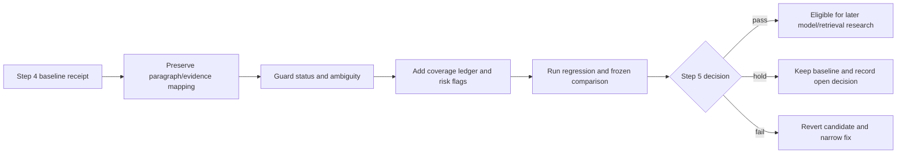

# Step 5: targeted preservation fix

Step 5 addresses only the defects demonstrated by Step 4. It does not start a
model tournament or redesign retrieval.

## Target changes

| Change | Reason | Boundary |
|---|---|---|
| Stable paragraph IDs through Humanizer | Prevent citation movement while prose changes | Splits/merges require explicit remapping review |
| Source-supported status guard | Stop ordinary statements becoming accepted/proposed decisions without evidence | Unresolved classification remains held |
| Historical-versus-ambiguity distinction | Avoid marking a dated limitation ambiguous merely because present state is unknown | Preserve the date and source wording |
| Source-first coverage ledger | Detect omissions that generated claims cannot reveal | Empty or excluded regions need reasons |
| High-risk review flags | Focus human attention on conditions, exceptions, identity and open schemas | Flags prioritize review; they never approve content |

## Work sequence

1. Implement one narrow change at a time and keep the previous behavior available.
2. Add a regression test for each Step 4 defect before changing the fixture set.
3. Keep source text immutable; generated prose and graph artifacts remain candidates.
4. Re-run the full existing suite, the frozen Step 4 set, and the unfamiliar local
   document.
5. Compare the new receipt with the Step 4 baseline; do not compare only aggregate
   scores.
6. Record a Step 5 decision in `verification.md` and `decisions.md`.

## Step 5 exit gate

The targeted fix is eligible for later quality research only when:

- the known status and false-ambiguity defects are fixed or explicitly held;
- evidence mappings remain stable after Humanizer edits;
- conditions, negation, dates, and source status remain attached to claims;
- source coverage is explicit and no region disappears silently;
- regression and rerun checks pass;
- no new provider, embedding, ranking, deployment, or active-index change was
  introduced; and
- the exact candidate code/config/source artifacts are recorded for rollback.
