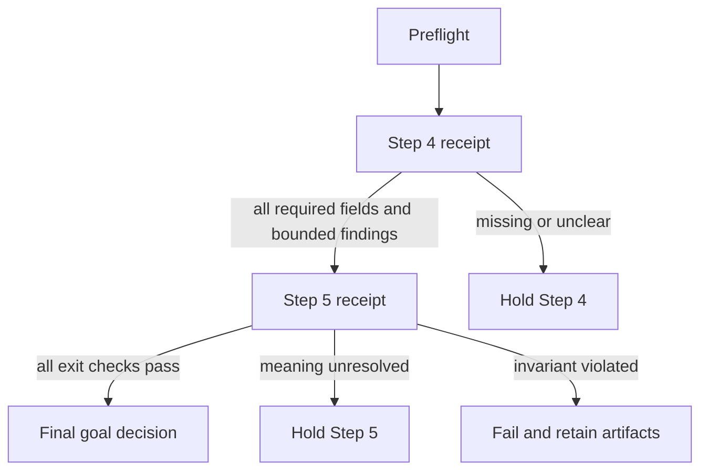

# Verification contract

This file is the evidence ledger for the goal. A checkbox without a receipt is
not completion. The original Step 4 and Step 5 receipts remain historical
artifacts; the current remediation status is recorded below and in
`Knowledge/Alexandria/graph/reviews/2026.09.22-gpt-soul-full-corpus/remediation-receipt.json`.

## Gate states

| State | Meaning | Next action |
|---|---|---|
| `pass` | Required checks are complete and no blocking finding remains | Advance to the next task |
| `hold` | Evidence is incomplete or meaning is unresolved | Preserve artifacts and clarify; do not advance |
| `fail` | The candidate violates a required invariant | Revert or narrow the change; retain the failed receipt |
| `inconclusive` | The test could not distinguish competing explanations | Add a better case or independent review |

## Preflight checks

- [x] Goal and phase are identified.
- [x] Source paths, revisions, hashes, and privacy scope are recorded.
- [x] Expected statuses and evidence were frozen before model input.
- [x] Code, prompt, dependency, and configuration identities are recorded.
- [x] Output directory is fresh and outside the active serving generation.
- [x] No credential, home directory, Docker socket, or working checkout is mounted
      into an untrusted model worker.

## Required receipt fields

```yaml
goal_id: quality-status-ambiguity-2026.09.21
phase: step-04 or step-05
status: pass | hold | fail | inconclusive
source_revision: <exact revision>
source_manifest_sha256: <hash>
code_revision: <exact revision>
configuration_identity: <hash or declared identity>
model_provider: <actual provider or local>
model_identity: <actual model and revision>
provider_identity:
  verified: true | false
  provider: <exact provider>
  model: <exact model>
expectation_revision: <hash>
output_manifest_sha256: <hash>
output_manifest_path: <run-relative path>
comparison_script_path: <run-relative path>
comparison_script_sha256: <hash>
checks:
  structural: pass | fail
  source_coverage: pass | fail | hold
  status_accuracy: pass | fail | hold
  ambiguity_handling: pass | fail | hold
  evidence_mapping: pass | fail | hold
  regression: pass | fail
findings: []
active_index_changed: false
next_action: <single bounded action>
```

If a provider or model identity cannot be verified, record that fact and mark the
receipt `hold`; do not substitute an alias for an identity. The output manifest
and comparison script must be present and hashable from the receipt directory;
their names alone are not evidence.

## Phase gates



## Final decision rule

The goal is complete only when Step 5 has a `pass` or an explicit owner-approved
`hold` that records the remaining limitation. A held result is not an accepted
graph and cannot replace the active index. Every failed or held attempt remains
available for comparison and recovery.

## Step 4 receipt recorded

The Step 4 receipt uses `status: hold` for the candidate and
`phase_status: pass-to-targeted-fix` for the bounded experiment. This keeps the
phase decision separate from candidate acceptance. The source-linked receipt and
full synthetic run are in the Knowledge repository at:

`Alexandria/graph/goals/2026.09.21-status-ambiguity/step-04-baseline/`

The receipt records source and expectation hashes, code revision, model route
identity limits, output manifest hash, mechanical coverage, two blocking
findings, and `active_index_changed: false`. Step 5 may implement only the
recorded targeted safeguards.

## Step 5 receipt recorded (historical)

The historical Step 5 receipt has `status: pass` and `phase_status: complete`
according to the checks that existed at that time. It remains immutable evidence
of that bounded run; it is not the current release decision. The current
replayability verifier holds it because the exact provider identity, output
manifest path, and comparison-script path are not independently recorded. The
strengthened deterministic gate also finds 14 semantic-risk claims in the
historical candidate. See the evidence-verification and quality-gate-rerun
receipts in the Knowledge remediation review.

The candidate remains `held-pending-owner-review`. No production index,
deployment, or model strategy changed. Failed provider/runtime attempts are
retained in the receipt, and the successful run records the configured route as
`chatgpt/gpt-5.6-sol` through the local LiteLLM gateway.

Receipt:

`Alexandria/graph/goals/2026.09.21-status-ambiguity/step-05-targeted-fix/comparison.json`

## Owner disposition receipt

The deterministic gate emits findings; it never chooses an owner decision. A
reviewer may create a separate JSON receipt with `review_version`, `reviewer`,
`reviewed_at`, and one `decisions` entry for every finding. Each entry must use
one of `accepted`, `corrected`, or `held`, retain the finding's original path
and quote, and include a bounded reason. A `corrected` entry also carries the
replacement wording. Validate it without executing a provider:

The current 14-finding skeleton is retained in
`Alexandria/graph/reviews/2026.09.22-gpt-soul-full-corpus/owner-review-template.json`.
It is intentionally a draft with blank decisions; it is not an owner review.

```bash
python scripts/validate_quality_review.py \
  --gate path/to/quality-gate-rerun.json \
  --review path/to/owner-review.json
```

The validator reports `complete` only when every finding has exactly one
source-bound disposition. A complete review that still contains `held` entries
reports `status: hold` and exits nonzero, so it cannot accidentally pass a
release gate. It always reports `automatic_acceptance: false`; a complete
disposition receipt is review evidence, not permission to alter the active index
or release a candidate.

## Authority and rendering review

The corpus manifest separately holds records whose source is present but whose
authority or rendering equivalence is unresolved. The generated review template
covers 23 `held_authority` records, including final-context additions, and two
`held_duplicate` records:

`Alexandria/graph/reviews/2026.09.22-gpt-soul-full-corpus/authority-review-template.json`

Validate the completed receipt with:

```bash
python scripts/validate_authority_review.py \
  --manifest /path/to/Knowledge/Alexandria/corpus/corpus-manifest.json \
  --review path/to/authority-review.json
```

The validator requires a source-bound decision for every held record. An
`accepted` decision also requires an explicit canonical variant and rendering-
equivalence evidence. Held or excluded decisions can make the review complete,
but they keep `release_ready` false. Duplicate records can never be accepted.

## Structured provenance classification

The structured-provenance scanner records hashes and JSON pointers, not raw
outside-checkout values. The bounded classification draft contains 259 items
and requires one owner classification and reason for each item:

```bash
python scripts/validate_structured_provenance_review.py \
  --review path/to/structured-provenance-classification.json
```

The validator rejects raw-value leakage, duplicate finding identities, missing
owner decisions, and invalid categories. Provenance-only,
historical-run-locator, and imported-source-provenance decisions can complete
the portability review. External-collection, global-task-edge, and held
decisions remain release blockers until the knowledge boundary is resolved.
The validator never rewrites the source records.

## Current remediation gate result

The current remediation remains `hold`. The eligible corpus candidate has been
rebuilt and passed direct data-block runtime smoke, but the code-only Docker
image has not been verified because the local Docker server API was unavailable.
Provenance gaps, the Story Cycle authority choice, provider identity, and
replayable comparison artifacts still require resolution. No production index,
deployment, or model strategy changed.
