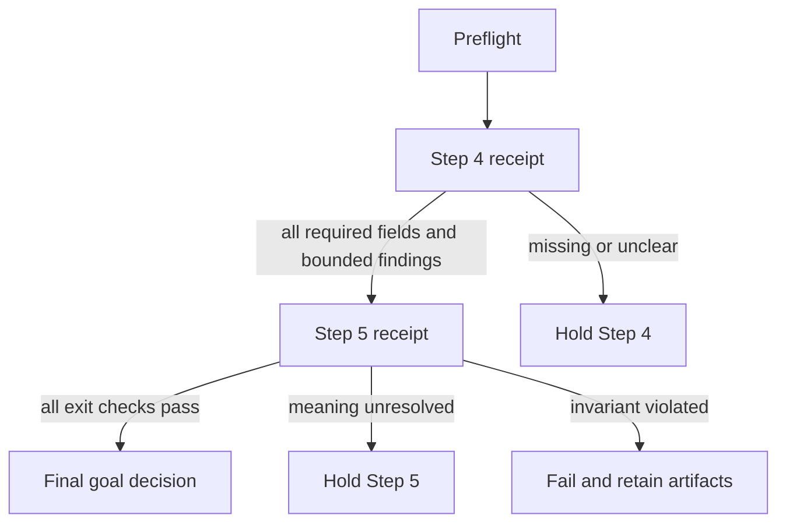

# Verification contract

This file is the evidence ledger for the goal. A checkbox without a receipt is
not completion.

## Gate states

| State | Meaning | Next action |
|---|---|---|
| `pass` | Required checks are complete and no blocking finding remains | Advance to the next task |
| `hold` | Evidence is incomplete or meaning is unresolved | Preserve artifacts and clarify; do not advance |
| `fail` | The candidate violates a required invariant | Revert or narrow the change; retain the failed receipt |
| `inconclusive` | The test could not distinguish competing explanations | Add a better case or independent review |

## Preflight checks

- [ ] Goal and phase are identified.
- [ ] Source paths, revisions, hashes, and privacy scope are recorded.
- [ ] Expected statuses and evidence were frozen before model input.
- [ ] Code, prompt, dependency, and configuration identities are recorded.
- [ ] Output directory is fresh and outside the active serving generation.
- [ ] No credential, home directory, Docker socket, or working checkout is mounted
      into an untrusted model worker.

## Required receipt fields

```yaml
goal_id: quality-status-ambiguity-2026.09.21
phase: step-04 or step-05
status: pass | hold | fail | inconclusive
source_revision: <exact revision>
source_manifest_sha256: <hash>
code_revision: <exact revision>
configuration_identity: <hash or declared identity>
model_provider: <actual provider or local>
model_identity: <actual model and revision>
expectation_revision: <hash>
output_manifest_sha256: <hash>
checks:
  structural: pass | fail
  source_coverage: pass | fail | hold
  status_accuracy: pass | fail | hold
  ambiguity_handling: pass | fail | hold
  evidence_mapping: pass | fail | hold
  regression: pass | fail
findings: []
active_index_changed: false
next_action: <single bounded action>
```

If a provider or model identity cannot be verified, record that fact and mark the
receipt `hold`; do not substitute an alias for an identity.

## Phase gates



## Final decision rule

The goal is complete only when Step 5 has a `pass` or an explicit owner-approved
`hold` that records the remaining limitation. A held result is not an accepted
graph and cannot replace the active index. Every failed or held attempt remains
available for comparison and recovery.
