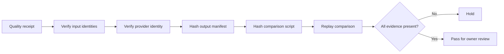

# Replayable quality evidence

Quality receipts are review evidence, not acceptance decisions. A receipt is
held unless another operator can verify the exact provider identity and replay
the comparison from the recorded artifacts.



The offline verifier is:

```text
python -m pi.alexandria.graph.evidence \
  --root /path/to/quality-run \
  --receipt comparison.json
```

It requires the receipt to identify the source, code, configuration, model,
expectations, output manifest, and comparison script. A local gateway alias or
an unverified provider route is recorded as a hold. A passing evidence check
still does not automatically promote a graph or change the active index.

## Structured provenance portability

Knowledge JSON and JSONL receipts may retain local paths as historical
provenance. The privacy-safe scanner classifies those values without printing
their contents:

```bash
python scripts/check_structured_provenance.py \
  --root /path/to/Knowledge \
  --json > structured-provenance-report.json
```

The report hashes path-like values and distinguishes values inside the checkout
from values outside it. For JSONL, each finding includes the zero-based physical
line number in its JSON pointer so the exact record can be reviewed. It never
rewrites records. A `hold` result means the records need classification before
the corpus can be described as fully portable; it does not mean historical
provenance should be deleted.

After scanning, complete the bounded owner classification and validate it:

```bash
python scripts/validate_structured_provenance_review.py \
  --review structured-provenance-classification-draft.json
```

Each finding must retain its file, JSON pointer, key, value hash and proposed
category. The owner adds one classification and a reason. The validator rejects
raw path values, duplicate identities and missing decisions. Provenance-only,
historical-run-locator and imported-source-provenance decisions can complete the
portability gate; external-collection, global-task-edge and held decisions keep
release blocked until the boundary is resolved.

Run all three review surfaces together before rebuilding a candidate block:

```bash
python scripts/validate_review_bundle.py \
  --quality-gate quality-gate-rerun.json \
  --quality-review owner-review.json \
  --manifest corpus-manifest.json \
  --authority-review authority-review.json \
  --provenance-review structured-provenance-classification.json
```

The default output is a summary suitable for CI logs. Use `--full` only in a
private review workspace when detailed findings are needed. The command exits
successfully only when every gate is complete and release-ready; it never
performs automatic acceptance or changes the active index.
