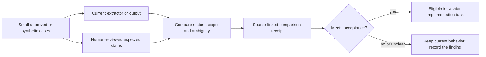

# Status and ambiguity quality baseline

This is the first quality slice for Alexandria. It defines how a later
implementation can preserve the difference between what a document says, what
has been proposed, and what remains unresolved. It is a contract for review; it
does not change the runtime, the active index, or the graph.

## Why this comes first

A retrieval result can be relevant and still be unsafe to use if it loses a
qualification such as **proposed**, **historical**, **deferred**, or **uncertain**.
The first quality gate therefore checks whether Alexandria keeps the source's
status and marks genuine ambiguity instead of silently choosing an interpretation.

## Scope of this draft

| Included | Explicitly deferred |
|---|---|
| A small, approved set of synthetic or local cases | Choosing an embedding or language model |
| A status vocabulary and ambiguity marker | Hybrid ranking, reranking, or query expansion |
| Source-linked expected outputs and comparison receipts | Full-corpus processing or index refresh |
| A hold decision when the result is unclear | Graph promotion, deployment, or provider changes |

No external model call, private-document upload, or production release is part
of this PR. The current serving generation remains unchanged.

## Proposed review flow

The comparison is a review artifact. A passing comparison does not by itself
publish a graph or replace the active data block.

## Status vocabulary

| Status | Meaning | Example signal |
|---|---|---|
| `accepted` | The source records a selected decision or fact for its stated scope | “The chosen host is Saturn.” |
| `proposed` | A suggestion or design direction, not a selected decision | “We could use…” |
| `open` | The source leaves the question unresolved | “The suffix format is undecided.” |
| `requirement` | A condition the system or workflow is expected to satisfy | “Preserve the original.” |
| `limitation` | A known boundary, failure mode, or missing capability | “Remote read coverage is incomplete.” |
| `historical` | A dated observation or receipt that should not be read as current state | “At 2026-09-19…” |
| `deferred` | Deliberately postponed work | “Registry work is deferred.” |

These labels describe the source and its scope. They do not establish that a
claim is true outside the cited evidence.

## Comparison cases

The first fixture set should contain one small example of each case:

| Case | Expected result |
|---|---|
| Clear selected decision | `accepted`, with its scope preserved |
| Suggested design | `proposed`, with no promotion to `accepted` |
| Unresolved question | `open`, with no invented answer |
| Explicit system condition | `requirement` |
| Known boundary or failure | `limitation` |
| Dated receipt | `historical`, retaining its observation date |
| Postponed work | `deferred` |
| Two plausible readings | A status plus an ambiguity marker and `held` review state |

Fixtures should be short enough that a reviewer can inspect every expected
answer by hand. A case may contain more than one claim when that tests whether a
qualification remains attached to the right claim.

## Output contract

Every compared claim must retain:

- the exact source path and a bounded source quote;
- the status label and the scope or time qualification that supports it;
- a stable case and claim identifier;
- an ambiguity marker when the evidence supports more than one reading;
- a review state (`pass`, `fail`, or `held`) separate from the claim status.

When the evidence is ambiguous, the output records the competing readings and
stays `held`. It must not choose one reading merely to complete a JSON shape.
The receipt also records the source revision and the comparison-contract version
so a later run can be reproduced.

## Measurements for the later implementation

The future evaluator should report counts and examples for:

1. status accuracy against the human-reviewed fixture;
2. ambiguity false positives and false negatives;
3. preservation of scope, negation, and time qualifications;
4. source-path and quote fidelity; and
5. reviewer effort, including claims held for clarification.

There is no fixed top-k, latency, or model score target in this slice. The first
question is whether meaning and uncertainty survive the transformation.

## Review gate

A later implementation may proceed only when a reviewer agrees that the fixture
set, vocabulary, ambiguity marker, and receipt fields are concrete enough to
measure. Until then:

- keep the active serving generation and committed source unchanged;
- use local fixtures or explicitly approved documents only;
- record failures without rewriting source material;
- keep unresolved cases held and visible; and
- add model or retrieval experiments as separate, reviewable changes.

The next step after approval is a small, bounded comparison experiment. Model
research, provider selection, and retrieval changes remain separate decisions.

The executable goal package for that experiment is [Status and ambiguity goal](goals/2026.09.21-status-ambiguity/goal.md). Its task queue, phase contracts, verification receipt, and decision log are advanced one item at a time.
