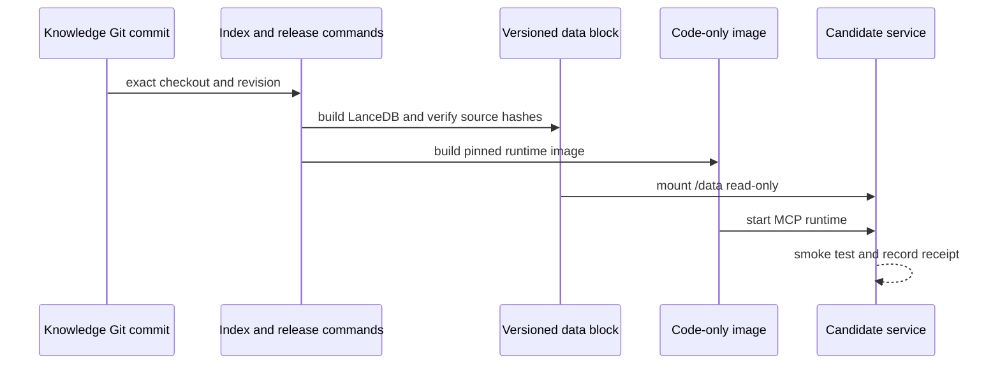

# Release workflow

Alexandria currently uses a manual, immutable release process. GitHub Actions
checks product changes, but it does not yet pull the private Knowledge corpus or
deploy a refreshed index.

## Inputs

Record these values before a release:

| Input | Meaning |
|---|---|
| Product revision | Alexandria code used to build the image |
| Knowledge revision | Exact Git commit indexed into the data block |
| Embedding model | Model used for both indexing and query embeddings |
| Corpus manifest | Release allowlist and provenance policy used for the index |
| Data-block output | New directory, never an in-place mutation of the prior release |

The manifest is also a byte-level provenance contract. Each `present` source
record supplies a repository-relative `source` and `source_sha256`; release
preparation verifies that blob at the selected Knowledge revision before it
copies or indexes the snapshot. The release is held when that closure cannot
be proven.

The release command refuses a Knowledge checkout whose `HEAD` does not equal
the selected revision, an active index built from another revision, an active
index built with another model, or an active index without a corpus-selection
receipt.

## Build and verify

1. Build the active LanceDB generation with
   `pi.alexandria.runtime.app index`.
2. Run `pi.alexandria.runtime.prepare_data_block` to copy the selected generation,
   source snapshot, model files, and receipt into a new data block. This step
   rechecks every eligible source blob against its manifest hash.
3. Run the product's portability check against the authored Knowledge paths:
   `python scripts/check_knowledge_boundary.py --root /path/to/Knowledge`.
   Add repeatable `--exclude` prefixes for preserved corpus, trial, and
   acquisition evidence. The checker validates Markdown links only; historical
   provenance values are retained for classification and are not rewritten.
4. Build `docker/Dockerfile.release` for the target architecture. Pass the
   application revision, indexed revision, CalVer release, and model as image
   labels.
5. Start a fresh container with `/data` mounted read-only.
6. Verify `status`, semantic search, literal search, document reads, path
   rejection, and container replacement persistence.
7. Record the image digest, data-block receipt, source hashes, model identity,
   and smoke-test result.

The image contains code and dependencies only. The data block contains the
corpus snapshot, LanceDB, and model files. Credentials and Git metadata are not
included in either artifact.

## Deployment

For Kubernetes, transfer and import the image privately, mount the
versioned data block at `/data` read-only, and expose only the authenticated
Streamable HTTP MCP route through the gateway. Use the attached-block template
in [deployment](../deployment/README.md) only after replacing its placeholders
from the live infrastructure inventory.

For a local stdio deployment, keep the data block on the trusted machine and
register the Docker command with the MCP client. No public route or OAuth is
needed.

## Replacement and rollback

Treat the image digest and data-block receipt as one release pair. Replace both
only after the candidate passes its checks. Retain the previous pair until the
new service has passed client, restart, and document-hash checks. Rollback means
starting the previous pair and restoring its route; it should not require a new
index build.

## Deferred automation

The next infrastructure step can automate this workflow from a GitHub commit,
but it needs a private image/data-block distribution path and a measured backup
strategy first. Until then, manual release keeps the trust boundary visible and
limits accidental corpus publication.
