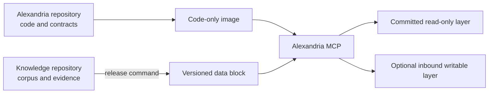

# Repository layout

Alexandria is intentionally split across two repositories. The split keeps the
runtime releasable without copying private corpus content into the product
repository.

| Location | Owns | Examples |
|---|---|---|
| `src/pi/alexandria/` | Product implementation | MCP runtime, graph readers, data-block preparation |
| `tests/pi/alexandria/` | Product tests | Runtime, graph, namespace, and container contracts |
| `docker/` | Image definitions | Code-only development and release images |
| `deployment/` | Product deployment contracts | Attached-block template and deployment guidance |
| `docs/` | Product operating documentation | Runtime, graph, recovery, and layout contracts |
| `scripts/` | Explicit operator checks | MCP smoke checks and change hygiene |
| `tools/` | Historical operator and research helpers | Curation, trials, and review probes; excluded from the image |
| `.local/` | Ignored workstation state | Local data blocks, delivery archives, and recovery copies |

The Knowledge repository owns Markdown and text sources, architecture and
ontology decisions, provenance, research, graph run outputs, receipts, and
source evidence. It does not provide the package imported by the runtime.

The product image contains code and pinned dependencies only. A release data
block contains the selected Knowledge snapshot, LanceDB generation, model files,
and release receipt. The committed data is read-only; only an explicitly
mounted inbound directory can be written by the runtime.

## Foundry conventions adopted

- `src/pi/alexandria` is a PEP 420 namespace: both `src/pi/__init__.py` and
  `src/pi/alexandria/__init__.py` are intentionally absent.
- Product code uses absolute imports and the package is discovered through
  `setuptools` namespace discovery.
- Python package metadata, development dependencies, and test discovery live in
  `pyproject.toml`; the checked-in `.python-version` keeps the verified Python
  3.12 deployment baseline explicit.
- `uv.lock` pins the development environment, and Ruff enforces import sorting,
  naming, bugbear checks, and absolute-import hygiene.
- Documentation is under `docs/`, generated build output is ignored, and the
  console entry point remains `alexandria` for compatibility.

Foundry's NumPy-style docstring checks are not enabled yet. The inherited graph
and operator modules predate that convention; adding docstrings is a separate
behavior-neutral maintenance pass rather than part of the repository split.
