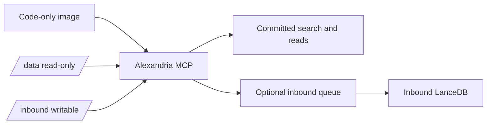
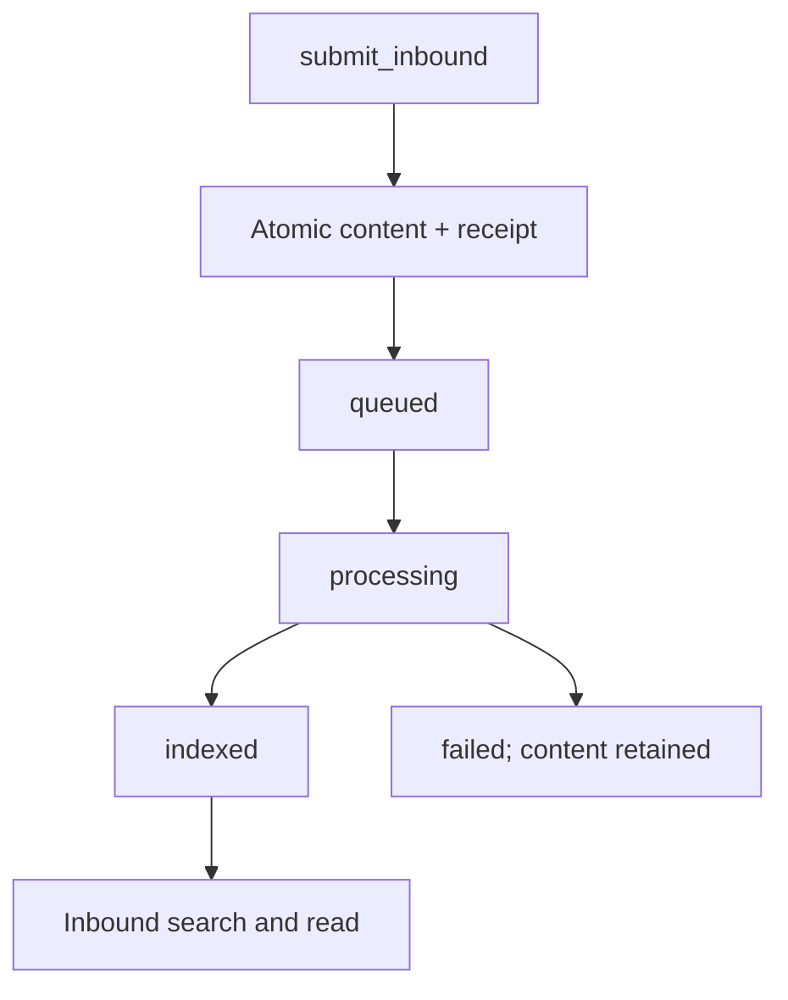

# Runtime contract

Alexandria’s runtime image is stateless. It contains Python code, pinned
dependencies, ripgrep, and no corpus, LanceDB generation, model cache, or
credential.



## Mounts

| Mount | Mode | Contents | Writes |
|---|---|---|---|
| `/data` | read-only | `active.json`, one selected generation, source snapshot, model files, release receipt | None during `serve` |
| `/inbound` | read-write, optional | SQLite catalog, server-named content, queue and receipts, inbound LanceDB | Only when inbound mode is explicitly enabled |

The application rejects caller-controlled paths and never writes into the
committed generation. `/inbound` is normally the data block’s hidden
`.alexandria-inbound` directory mounted at a stable path.

## MCP tools

The default server registers five tools:

| Tool | Purpose |
|---|---|
| `search` | Semantic retrieval from `committed`, `inbound`, or `all`; committed is the default. |
| `text_search` | Fixed-string ripgrep over the selected text layer. |
| `read_document` | Bounded source reads, including server-issued inbound paths and raw frontmatter-only mode. |
| `status` | Active generation and block state, or one inbound receipt. |
| `list_files` | Bounded deterministic tree with hashes, revision/submission identity, and optional raw frontmatter. |

`submit_inbound` appears only when both `--enable-inbound` and a writable
`--inbound` mount are provided. It accepts Markdown/plain text up to 256 KiB,
uses a server-generated ID, records the verified MCP subject and client ID,
and returns a `queued` receipt. One background worker processes submissions in
order, retries at most three times, and retains failed content.



## Run locally

```text
python -m pi.alexandria.runtime.app serve --data /path/to/data
```

For authenticated remote MCP, add `--transport streamable-http`, the exact
issuer/resource/JWKS/scope settings, and `ALEXANDRIA_ALLOWED_SUBJECTS`. The
resource URL must be HTTPS. Inbound mode is an explicit deployment decision;
it is never inferred from the presence of a directory.

## Release data

Use `python -m pi.alexandria.runtime.prepare_data_block` with an exact Knowledge checkout, exact
revision, selected embedding model, and a new output directory. The command
refuses a revision or model mismatch and compares every Markdown/text source
hash before publishing the receipt. Build the image from the repository root
with `docker/Dockerfile`; the image does not copy the output block.
